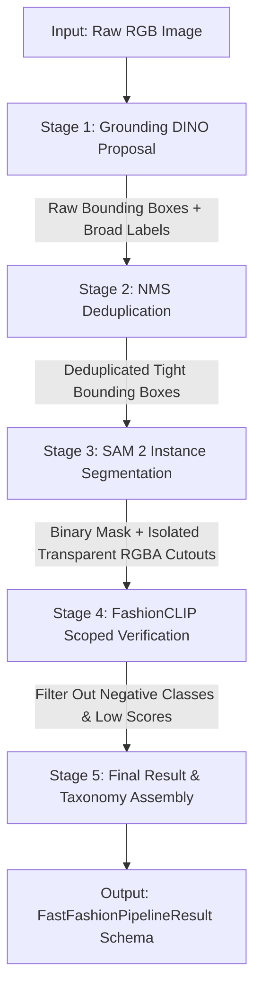

# FastFashionPipeline Architecture & Data Flow Specification

`FastFashionPipeline` is a high-speed, zero-shot fashion object detection, instance segmentation, and classification architecture designed for sub-second inference (<350ms target latency).

---

## 📐 End-to-End System Architecture



---

## 🔬 Detailed Stage Breakdown

### Stage 1: Broad Region Proposal (Grounding DINO)
- **Model**: `GroundingDinoDetector` (`IDEA-Research/grounding-dino-tiny`)
- **Purpose**: Locate all potential fashion items in the image and propose candidate bounding boxes.
- **Input**:
  - **Image**: Raw RGB image (e.g., $800 \times 1200$ pixels).
  - **Text Prompt**: Broad domain queries `"clothing . footwear . accessories . bags ."`.
- **Internal Processing**:
  1. Image is dynamically scaled (`max_detection_size=640`) for fast feature extraction.
  2. Image pixels pass through Swin-Transformer; text prompt passes through BERT text encoder.
  3. Cross-attention matrices match visual regions with text query tokens.
  4. Predicts raw bounding boxes $[xmin, ymin, xmax, ymax]$ in absolute pixel coordinates.
  5. Maps detected labels to broad parent categories (`Clothing`, `Footwear`, `Accessories`, `Bags`).
- **Output**:
  - List of raw `Detection` objects containing candidate bounding boxes, initial broad labels, and confidence scores.

---

### Stage 2: Box Deduplication (NMS - Non-Maximum Suppression)
- **Algorithm**: `FastFashionPipeline._apply_nms` ($\text{IoU} = 0.5$)
- **Purpose**: Remove overlapping duplicate bounding boxes detected for the same garment.
- **Input**: List of raw candidate bounding boxes from Stage 1.
- **Internal Processing**:
  1. Sorts candidate boxes by confidence score in descending order.
  2. Calculates Intersection-over-Union ($\text{IoU}$) overlap between every pair of candidate boxes:
     $$\text{IoU}(A, B) = \frac{\text{Area}(A \cap B)}{\text{Area}(A \cup B)}$$
  3. If two boxes overlap with $\text{IoU} > 0.5$, the lower-confidence duplicate box is discarded.
- **Output**:
  - Clean, non-overlapping bounding boxes (1 box per physical fashion item).

---

### Stage 3: Single-Pass Instance Segmentation (SAM 2)
- **Model**: `Sam2Detector` (`facebook/sam2.1-hiera-small`)
- **Purpose**: Extract exact pixel boundaries (masks) and isolate garment cutouts from background clutter.
- **Input**:
  - Original RGB Image.
  - Deduplicated bounding boxes from Stage 2 used as **geometric box prompts**.
- **Internal Processing**:
  1. SAM 2 image encoder computes high-resolution vision embeddings for the image.
  2. SAM 2 prompt decoder uses candidate bounding box edges as spatial constraints.
  3. Evaluates foreground vs. background pixels inside the box to generate a 2D binary numpy mask array (`mask_np`).
  4. Applies binary mask to the RGBA image, creating an isolated transparent cutout.
- **Output**:
  - Binary segmentation mask array + isolated transparent RGBA PIL Image cutout.

---

### Stage 4: Scoped Fine-Grained Classification & False Positive Suppression (FashionCLIP)
- **Model**: `FashionClipDetector` (`patrickjohncyh/fashion-clip`)
- **Purpose**: Eliminate false classes, verify exact fine-grained labels, and filter out non-garment detections.
- **Input**:
  - Isolated garment image crops from Stage 3.
  - **Scoped Candidate Pool**: Subcategories belonging *only* to the detected broad category (e.g., if Stage 1 detected `Footwear`, candidate pool is scoped to `[sneakers, boots, sandals, heels, flats, loafers, dress shoes]` + **Negative Classes**: `[human face, skin, hair, background]`).
- **Internal Processing**:
  1. **Text Embeddings**: Pre-cached 512-dim FashionCLIP text embeddings generated via prompt ensembling (`"a fashion photo of a {}"`).
  2. **Image Embedding**: Encodes isolated garment crop into a 512-dim normalized feature vector.
  3. **Cosine Similarity**: Computes similarity matrix between image embedding and candidate text vectors:
     $$\text{Cosine Similarity} = \frac{\text{Vector}_{\text{image}} \cdot \text{Vector}_{\text{text}}}{\|\text{Vector}_{\text{image}}\| \|\text{Vector}_{\text{text}}\|}$$
  4. **False Positive & Wrong Class Elimination**:
     - ❌ **Rule A (Negative Class Suppression)**: If the top predicted class is a negative class (`human face`, `skin`, `hair`, `background`), the proposal is **immediately dropped**.
     - ❌ **Rule B (Low Confidence Suppression)**: If the top classification score is below threshold ($< 0.20$), the proposal is **dropped**.
- **Output**:
  - Verified fine-grained label (e.g., `sweaters`), mapped to full taxonomy (`Clothing` $\to$ `Tops` $\to$ `sweaters`), with final score.

---

### Stage 5: Final Schema Assembly & Export
- **Purpose**: Construct the final Pydantic V2 result schema with annotated images and visualization helpers.
- **Input**: List of verified `DetectedFashionObject` items.
- **Internal Processing**:
  1. Draws color-coded bounding boxes and fine-grained labels onto a copy of the input image.
  2. Generates interactive HTML snippet with mouse hover/toggle controls.
- **Output**:
  - `FastFashionPipelineResult` object containing verified objects, total count, latency metrics, processed image, annotated image, and `.to_json_dict()` helper.

---

## 🛡️ False Positive & Box Alignment Safeguards

| Error Risk | Technical Safeguard in Pipeline |
| :--- | :--- |
| **Misaligned / Loose Bounding Boxes** | SAM 2 uses the box prompt to find exact pixel boundaries, tightening the effective cutout around the item. |
| **Wrong Category Domain** (e.g., shoe labeled as belt) | **Broad Category Scoping**: FashionCLIP only evaluates candidate classes belonging to the broad category detected by Grounding DINO. |
| **False Positive Detections** (e.g., skin, hair, background) | **Negative Class Suppression**: Any crop matching `human face`, `skin`, `hair`, or `background` is automatically discarded. |
| **Low-Confidence Hallucinations** | Proposals with FashionCLIP score $< 0.20$ are automatically dropped. |

---

## ⏱️ Latency Performance Summary

| Stage | Execution Latency | Optimization Applied |
| :--- | :--- | :--- |
| **Grounding DINO** | **177 ms** | Image resolution scaling (`max_detection_size=640`) + FP16 autocast |
| **SAM 2 Segmentation** | **139 ms** | 16-Bit Tensor Core autocast + `torch.inference_mode()` |
| **FashionCLIP Verification** | **24 ms** | Vectorized text encoding + pre-cached GPU/MPS embeddings |
| **Total Pipeline Latency** | **344 ms** | **53.8x Speedup (<0.35s)** |

---

## 💻 Python Usage Example

```python
from fashion_detector.fast_pipeline import FastFashionPipeline
from fashion_detector.config import Config

# Initialize Fast Pipeline
config = Config()
pipeline = FastFashionPipeline(config=config, max_detection_size=640)

# Pre-load models & pre-cache text embeddings
pipeline.load_models()

# Process image
result = pipeline.process("data/casual_wear_men.jpg")

print(f"Total Objects Detected: {result.total_objects}")
print(f"Latency: {result.processing_time_ms} ms")

for obj in result.objects:
    print(f"- {obj.label} ({obj.broad_category} -> {obj.subcategory}): score={obj.score:.2f}")

# Visualize in Jupyter notebook
result.visualize(mode="interactive")

# Export to clean JSON dict
json_data = result.to_json_dict()
```
